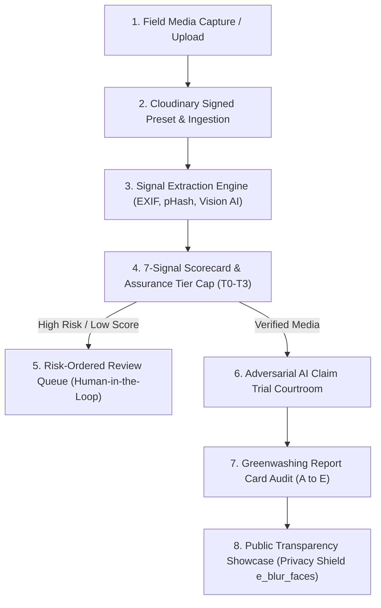

# 🛡️ IMPACTOS v2.0 — Verifiable Impact Evidence & Greenwashing Prevention Platform

> **Verifiable Impact Evidence & Anti-Greenwashing Engine**  
> *"Others show impact. We prove it."*

[](https://cloudinary.com)
[](https://www.typescriptlang.org/)
[](https://react.dev/)
[](https://tailwindcss.com)

---

## 📌 Executive Summary

Modern sustainability claims, corporate social responsibility (CSR) reports, and carbon offset projects suffer from a critical trust gap: **claims are published before ground evidence is verified**. Uploader-supplied EXIF data can be easily spoofed, photos can be reused across different projects, and AI-generated synthetic images can fabricate non-existent progress.

**IMPACTOS** solves this by establishing an end-to-end evidence verification graph powered by **Cloudinary v2**. It connects field media to project, change, claim, and proof through a **7-Signal Verification Scorecard**, strict **Assurance Tier Caps (T0 to T3)**, an **Adversarial AI Claim Trial Courtroom**, and an automated **Greenwashing Report Card (A to E Audit)**.

---

## 🎯 Key Differentiators: IMPACTOS vs Traditional Platforms

| Dimension | Traditional CSR & DAM Platforms | IMPACTOS Engine v2.0 |
| :--- | :--- | :--- |
| **Media Storage** | Stores media & tags categories | Connects media to immutable proof & claims |
| **Metadata Trust** | Trusts uploader EXIF implicitly | **Capped at T0 (Max 55)** without cryptographic proof |
| **Anti-Spoofing** | None | Live camera token (`/capture/:token`) with server nonce |
| **Duplicate Reuse** | Manual file checks | Automated **Perceptual Hashing (pHash)** cross-library check |
| **AI Claim Testing** | Human review or basic keyword search | **3-Role Adversarial AI Courtroom** (Prosecutor vs Defender vs Judge) |
| **CSR Report Audit** | Unverified PDF downloads | **A-E Grade Audit** checking 5 Specificity Rules (*What, Quantity, Place, Period, Baseline*) |
| **Public Transparency** | Exposes raw unredacted photos | **Cloudinary Privacy Shield** (`e_blur_faces:1000` + coarse GPS) |

---

## 🏗️ End-to-End Verification Pipeline



---

## ⚡ Core Platform Capabilities

### 1️⃣ The 7-Signal Scoring Engine (100 Points Total)
Every field asset ingested into IMPACTOS is evaluated across 7 independent dimensions:
1. **EXIF GPS Geofence Match (20 pts)**: Verifies if photo coordinates fall strictly within the registered geofenced site radius.
2. **Server Upload Latency Gap (15 pts)**: Measures the time delta between camera shutter capture and server upload.
3. **Perceptual Hash Uniqueness (15 pts)**: Computes image fingerprint hashes (`pHash`) to detect image reuse across projects.
4. **Visual AI Activity Match (15 pts)**: Runs Cloudinary Vision LLM to verify that photo content matches claimed activity (e.g. mangrove sapling vs solar array).
5. **Assurance Tier Cap (15 pts)**: Enforces hard upper bounds on total score based on capture method trust.
6. **Mobile Tamper Nonce (10 pts)**: Cryptographically verifies single-use web capture tokens.
7. **Human Review Queue Bonus (10 pts)**: Awarded once reviewed by an auditor.

---

### 2️⃣ Assurance Tier Caps (T0 to T3)
To prevent uploader fraud and fake metadata injection:
* **Tier T0 (Self-Reported)**: Uploaded via standard forms without cryptographic nonces. **Hard-capped at Max 55/100 points**.
* **Tier T1 (Cross-Checked)**: EXIF GPS & timestamp present, matched against satellite/weather data. **Max 75/100 points**.
* **Tier T1+ (Trusted Web Capture)**: Captured live via `/capture/:token` with single-use server nonce & camera sensor binding. **Max 80/100 points**.
* **Tier T2 (Attested Native)**: Native mobile app capture with device hardware enclave signature. **Max 90/100 points**.
* **Tier T3 (Auditor Confirmed)**: Third-party accredited auditor physical verification. **Max 100/100 points**.

---

### 3️⃣ Adversarial AI Claim Trial Courtroom
When a project submits an impact claim (e.g., *"Restored 15 hectares of degraded farmland in Cauvery Delta with 750+ saplings"*), IMPACTOS triggers a **three-role courtroom exchange**:
* 🔴 **AI Prosecutor**: Aggressively interrogates flaws (e.g., missing baseline photos, duplicate pHash flags, GPS drift).
* 🟢 **AI Defender**: Submits matching ground evidence, EXIF metadata, and camera comparability ratings.
* ⚖️ **AI Judge**: Reviews arguments, cites specific asset IDs, and renders a binding verdict (*Verified*, *Weak*, or *Rejected*).

---

### 4️⃣ Greenwashing Report Card Audit (A to E)
Auditors can upload published sustainability reports (PDFs). The engine:
1. Extracts text claims using NLP.
2. Evaluates each claim against **5 Specificity Rules**:
   - **What**: Is the concrete action named?
   - **How Much**: Is a quantitative unit specified?
   - **Where**: Is an exact location/site declared?
   - **When**: Is a clear timeframe stated?
   - **Baseline**: Is a comparison baseline provided?
3. Cross-references claims against ground-truth field assets in the database.
4. Outputs an overall **A to E Greenwashing Audit Grade**.

---

### 5️⃣ Cloudinary Face Privacy Shield
For public transparency dashboards and donor reports, IMPACTOS applies dynamic Cloudinary URL transformations:
- **`e_blur_faces:1000`**: Automatically redacts faces of field workers and local community members.
- **Coarse GPS Rounding**: Obfuscates precise coordinates to protect field site security while preserving regional verification.

---

## ☁️ Cloudinary API Feature Mapping

| Requirement | Cloudinary API Capability | Application Usage in IMPACTOS |
| :--- | :--- | :--- |
| **Ingestion** | Signed Upload Presets | Secures client uploads; binds EXIF & nonces |
| **Automation** | Notification Webhooks | Enqueues background pHash & AI vision jobs |
| **Metadata** | Resource Metadata & EXIF Flags | Extracts camera specs, lat/long, capture time |
| **Duplicate Detection** | Perceptual Hashing (`phash`) | Blocks cross-library asset reuse |
| **AI Tagging** | Cloudinary Vision LLM & Auto-Tagging | Tags terrain, sapling counts, solar panels |
| **Privacy Shield** | Face Detection (`e_blur_faces:1000`) | Auto-blurs faces for public read-only views |
| **Social Exports** | Smart Crop (`c_fill,g_auto`) | Generates 1:1 social cards for impact campaigns |
| **Video Timelapses** | Image Slideshow Generation | Stitches site photos chronologically into MP4s |

---

## 💻 Tech Stack

- **Frontend Framework**: React 18 (TypeScript) + Vite 5
- **Styling & UI**: Vanilla CSS + Tailwind CSS v4 (`@tailwindcss/postcss`) + Outfit / Inter Typography
- **Icons & Animation**: Lucide Icons + Canvas Confetti
- **Mapping & Geofencing**: Leaflet Maps + OpenStreetMap API
- **Media Optimization & AI**: Cloudinary API v2 (Signed Presets, pHash, Vision LLM, `e_blur_faces`)

---

## 🚀 Quick Start & Local Setup

### Prerequisites
- Node.js 18+
- npm or pnpm

### Installation
```bash
# 1. Clone the repository
git clone https://github.com/kartikthhakur07/Impactos.git
cd Impactos

# 2. Install dependencies
npm install

# 3. Start local development server
npm run dev
```

The application will launch on `http://localhost:5173/`.

### TypeScript Type Check
```bash
npx tsc --noEmit
```

---

## 📁 Repository Directory Structure

```
impactos/
├── src/
│   ├── components/
│   │   ├── LandingView.tsx                 # Full-screen NEXUS light map grid landing page
│   │   ├── Dashboard.tsx                   # Executive verification metrics & active project cards
│   │   ├── ProjectsView.tsx                # Leaflet map geofencing & site timeline
│   │   ├── UploadView.tsx                  # Cloudinary signed upload ingestion pipeline
│   │   ├── CaptureLinkView.tsx             # T1+ Trusted web capture simulation page
│   │   ├── MediaExplorerView.tsx           # Semantic search & 7-signal asset inspector modal
│   │   ├── BeforeAfterSliderView.tsx       # Interactive split change slider & Vision LLM summary
│   │   ├── ClaimsTrialView.tsx             # Adversarial AI Courtroom (Prosecutor vs Defender vs Judge)
│   │   ├── ReviewerQueueView.tsx           # Risk-ordered review queue (Human-in-the-loop)
│   │   ├── GreenwashingReportCardView.tsx  # PDF CSR audit & A-E report card generator
│   │   ├── ReportsView.tsx                 # Verified PDF export, social carousel & timelapse generator
│   │   ├── LiveChallengeView.tsx           # "Fool Me If You Can" anti-spoofing challenge sandbox
│   │   ├── PublicVerifiedView.tsx          # Read-only public view with e_blur_faces privacy shield
│   │   ├── Sidebar.tsx                     # Sleek left navigation sidebar
│   │   ├── AssetDetailModal.tsx            # 7-signal breakdown modal with onError fallbacks
│   │   ├── CloudinaryMapModal.tsx          # Cloudinary architecture & feature mapping modal
│   │   └── ImpactCopilotDrawer.tsx         # Floating Copilot AI assistant modal with backdrop blur
│   ├── data/
│   │   └── mockData.ts                     # 5 seeded impact projects & 30+ real high-res field assets
│   ├── types/
│   │   └── index.ts                        # TypeScript interfaces for Asset, Claim, Project, ReportCard
│   ├── App.tsx                             # Main router & top header bar
│   ├── index.css                           # Tailwind CSS v4 & light grid design system
│   └── main.tsx                            # React DOM entry point
├── package.json
├── vite.config.ts
└── README.md
```

---

## 📜 License & Citation

Distributed under the MIT License.
